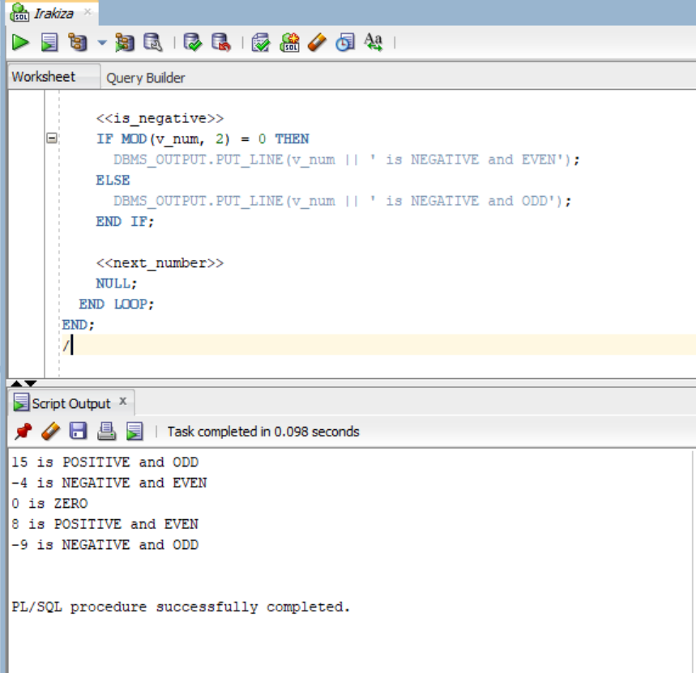
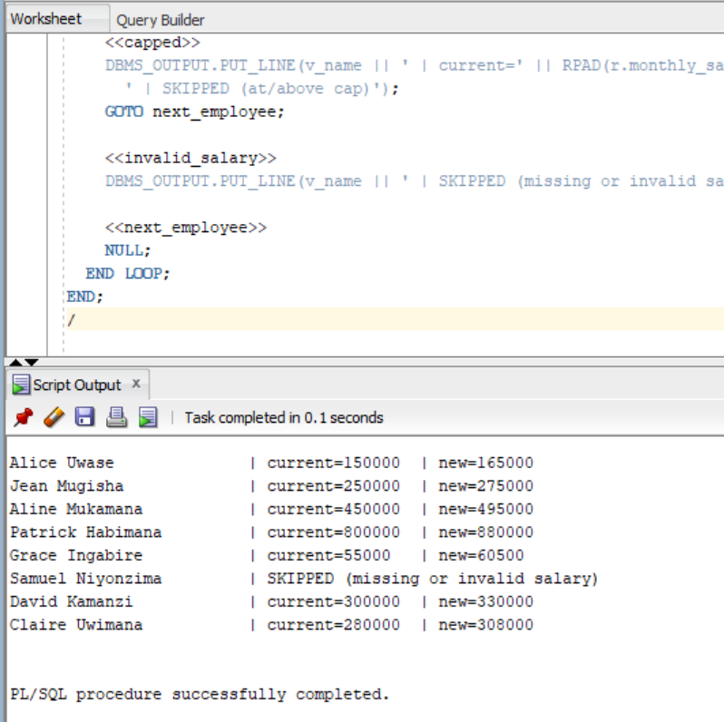
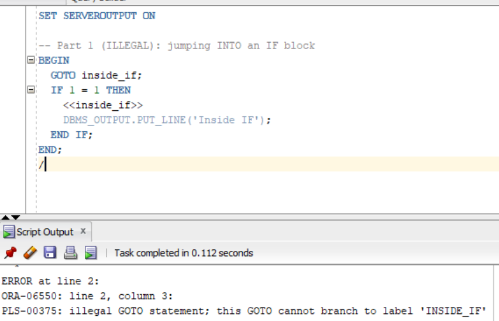
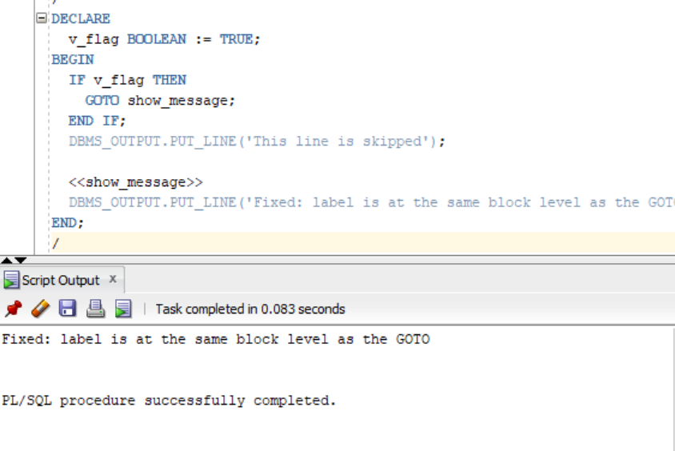
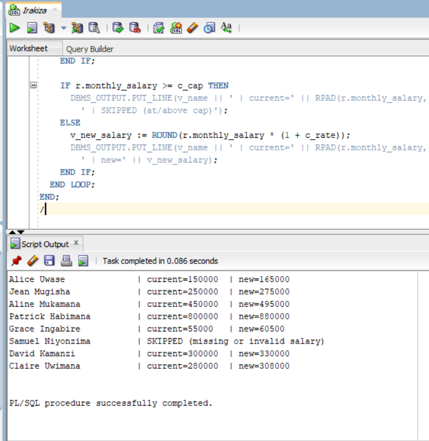
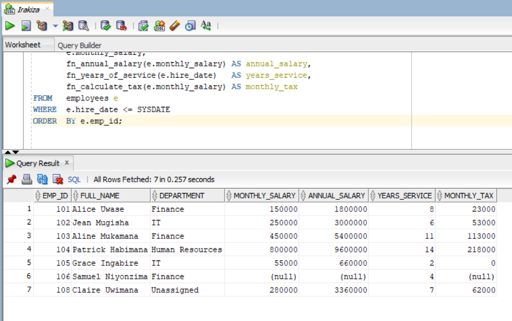
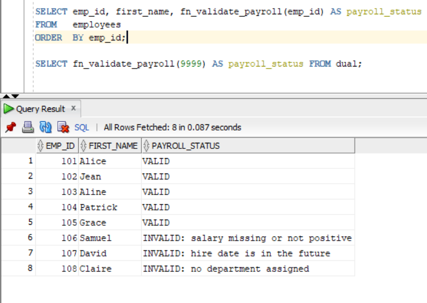
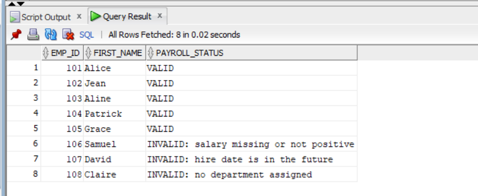

# PL/SQL GOTO Statements and Functions — Individual Assignment III

| | |
|---|---|
| **Course** | Database Development with PL/SQL (INSY 8311) |
| **Instructor** | Eric Maniraguha (eric.maniraguha@auca.ac.rw) |
| **Student** | BLAISE (ID: 29289) |
| **Repository** | `plsql-goto-functions-29289-BLAISE` |
| **Database** | Oracle (SQL*Plus / SQL Developer) |
| **Deadline** | Thursday, 8 October 2026, 11:59 PM |

## Overview

This repository contains the complete solution for Individual Assignment III. It covers:

- **Part A (A1–A4):** PL/SQL `GOTO` statements — legal jumps to labels, two illegal jumps (with the compiler errors they produce) and the same program rewritten without `GOTO`.
- **Part B (B1–B5):** Stored functions — annual salary, years of service, tax calculation, department name lookup, and their use inside SQL (`SELECT`, `WHERE`, `GROUP BY`).
- **Part C (C1–C2):** A payroll validator that combines functions, exception handling and `GOTO`, plus a written reflection.

Every program and test has a screenshot of its actual output in `screenshots/`, shown together with the command that produces it below.

## Prerequisites

- Oracle Database (any recent version) with rights to `CREATE TABLE` / `CREATE FUNCTION`
- SQL*Plus or SQL Developer
- Run the scripts **in the order given below** — the functions read the tables created in step 1, and `C1` calls the tax function from B3.

## Repository Structure

```
plsql-goto-functions-29289-BLAISE/
├── README.md                      ← this file (tasks, commands, outputs)
├── .gitignore
├── 00_setup/
│   └── create_tables.sql          ← DEPARTMENTS + EMPLOYEES tables and sample data
├── 01_goto/
│   ├── A1_number_classifier.sql   ← A1: number classifier with GOTO
│   ├── A2_salary_review.sql       ← A2: salary review with GOTO
│   ├── A3_illegal_goto.sql        ← A3: two illegal GOTOs + fix
│   └── A4_rewrite_no_goto.sql     ← A4: A2 rewritten without GOTO
├── 02_functions/
│   ├── B1_fn_annual_salary.sql    ← B1: monthly salary × 12
│   ├── B2_fn_years_of_service.sql ← B2: whole years since hire date
│   ├── B3_fn_calculate_tax.sql    ← B3: progressive tax
│   ├── B4_fn_dept_name.sql        ← B4: department name lookup
│   └── C1_fn_validate_payroll.sql ← C1: payroll validator (GOTO single exit)
├── 03_tests/
│   ├── B5_functions_in_select.sql ← B5: functions in SELECT / WHERE / GROUP BY
│   ├── test_functions.sql         ← unit tests for B1–B4
│   └── test_validate_payroll.sql  ← runs C1 for every employee
├── screenshots/                   ← actual output of every task
└── docs/
    └── REFLECTION.md              ← C2: written reflection
```

## How to Run

Open SQL*Plus in the repository root (or open each file in SQL Developer) and execute in this order:

```sql
-- Step 1: tables and sample data (8 employees, 4 departments)
@00_setup/create_tables.sql

-- Step 2: create the functions (order matters: C1 calls fn_calculate_tax)
@02_functions/B1_fn_annual_salary.sql
@02_functions/B2_fn_years_of_service.sql
@02_functions/B3_fn_calculate_tax.sql
@02_functions/B4_fn_dept_name.sql
@02_functions/C1_fn_validate_payroll.sql

-- Step 3: GOTO exercises (A3 parts 1-2 are SUPPOSED to fail)
@01_goto/A1_number_classifier.sql
@01_goto/A2_salary_review.sql
@01_goto/A3_illegal_goto.sql
@01_goto/A4_rewrite_no_goto.sql

-- Step 4: tests
@03_tests/test_functions.sql
@03_tests/B5_functions_in_select.sql
@03_tests/test_validate_payroll.sql
```

`SHOW ERRORS` after each `CREATE FUNCTION` confirms that all functions compile successfully.

---

## Part A — GOTO Statements

### A1 — Number Classifier

| | |
|---|---|
| **Task** | Classify a list of numbers (15, -4, 0, 8, -9) as ZERO / POSITIVE / NEGATIVE and, for non-zero, EVEN / ODD — using `GOTO` to jump to the matching label. |
| **File** | `01_goto/A1_number_classifier.sql` |
| **Command** | `@01_goto/A1_number_classifier.sql` |

**How it works:** for each number the block jumps to `<<is_zero>>`, `<<is_positive>>` or `<<is_negative>>`, and each section jumps to the common `<<next_number>>` label so the loop continues.

**Expected output:**

```
15 is POSITIVE and ODD
-4 is NEGATIVE and EVEN
0 is ZERO
8 is POSITIVE and EVEN
-9 is NEGATIVE and ODD
```

**Screenshot:**



---

### A2 — Salary Review

| | |
|---|---|
| **Task** | Give every employee a 10% raise unless the salary is missing/invalid (skip) or is at/above the 2,000,000 cap (skip) — implemented with the labels `give_raise`, `capped`, `invalid_salary` and `next_employee`. |
| **File** | `01_goto/A2_salary_review.sql` |
| **Command** | `@01_goto/A2_salary_review.sql` |

**Expected output:**

| Employee | Current salary | Result |
|---|---|---|
| Alice Uwase | 150,000 | new = 165,000 |
| Jean Mugisha | 250,000 | new = 275,000 |
| Aline Mukamana | 450,000 | new = 495,000 |
| Patrick Habimana | 800,000 | new = 880,000 |
| Grace Ingabire | 55,000 | new = 60,500 |
| Samuel Niyonzima | NULL | SKIPPED (missing or invalid salary) |
| David Kamanzi | 300,000 | new = 330,000 |
| Claire Uwimana | 280,000 | new = 308,000 |

No sample employee reaches the 2,000,000 cap, so the `<<capped>>` branch does not appear in this output.

**Screenshot:**



---

### A3 — Illegal GOTO and Fix

| | |
|---|---|
| **Task** | Show two **illegal** `GOTO` jumps and the compiler errors they cause, then show the corrected version. |
| **File** | `01_goto/A3_illegal_goto.sql` |
| **Command** | `@01_goto/A3_illegal_goto.sql` |

| Part | Code | Result |
|---|---|---|
| 1 | `GOTO` **into an IF block** | **PLS-00375** — illegal jump to label 'INSIDE_IF' |
| 2 | `GOTO` **into a loop** | **PLS-00201** — illegal jump to label 'INSIDE_LOOP' / loop must be a `LOOP...END LOOP` |
| 3 | **Fix:** label placed at the **same block level** as the GOTO | Compiles and runs: *"Fixed: label is at the same block level as the GOTO"* |

**Rule:** a label must belong to the same block as its `GOTO` or to an enclosing block — you cannot jump *into* an IF block or *into* a loop.

**Screenshot (errors + fixed part 3):**



**Screenshot (corrected version output):**



---

### A4 — Rewrite Without GOTO

| | |
|---|---|
| **Task** | Rewrite A2 using only `IF / ELSIF / ELSE` and `CONTINUE` — no `GOTO`, no labels — and compare readability. |
| **File** | `01_goto/A4_rewrite_no_goto.sql` |
| **Command** | `@01_goto/A4_rewrite_no_goto.sql` |

**Expected output:** identical to A2 (table above).

**Screenshot:**



---

## Part B — Functions

### B1 — Annual Salary

| | |
|---|---|
| **Signature** | `fn_annual_salary(p_monthly_salary NUMBER) RETURN NUMBER` |
| **Logic** | `monthly × 12`; `NULL` in → `NULL` out |
| **Exceptions** | `RAISE_APPLICATION_ERROR(-20001)` if the salary is negative |
| **File / Command** | `02_functions/B1_fn_annual_salary.sql` → `@02_functions/B1_fn_annual_salary.sql` |

### B2 — Years of Service

| | |
|---|---|
| **Signature** | `fn_years_of_service(p_hire_date DATE) RETURN NUMBER` |
| **Logic** | `TRUNC(MONTHS_BETWEEN(SYSDATE, hire_date) / 12)` — whole years worked |
| **Exceptions** | `RAISE_APPLICATION_ERROR(-20002)` if the hire date is in the future |
| **File / Command** | `02_functions/B2_fn_years_of_service.sql` → `@02_functions/B2_fn_years_of_service.sql` |

### B3 — Tax Calculator

| | |
|---|---|
| **Signature** | `fn_calculate_tax(p_monthly_salary NUMBER) RETURN NUMBER` |
| **Logic** | Progressive brackets: 0% up to 60,000 · 20% on 60,001–100,000 · 30% above 100,000 (with 8,000 base) |
| **Exceptions** | `RAISE_APPLICATION_ERROR(-20003)` on a negative salary |
| **File / Command** | `02_functions/B3_fn_calculate_tax.sql` → `@02_functions/B3_fn_calculate_tax.sql` |

### B4 — Department Name

| | |
|---|---|
| **Signature** | `fn_dept_name(p_dept_id NUMBER) RETURN VARCHAR2` |
| **Logic** | Looks up `departments.dept_name` |
| **Exceptions** | `NO_DATA_FOUND` → `'Unknown department'`; `NULL` id → `'Unassigned'` |
| **File / Command** | `02_functions/B4_fn_dept_name.sql` → `@02_functions/B4_fn_dept_name.sql` |

### Function test results

Run: `@03_tests/test_functions.sql`

| Test | Input | Expected result |
|---|---|---|
| B1 | 250000 | 3,000,000 |
| B1 | NULL | NULL |
| B1 | -1 | ORA-20001 *"Monthly salary cannot be negative"* (caught) |
| B2 | 2012-01-20 | whole years of service |
| B2 | 2099-01-01 | ORA-20002 *"Hire date cannot be in the future"* (caught) |
| B3 | 50000 | 0 |
| B3 | 80000 | 4,000 |
| B3 | 250000 | 53,000 |
| B4 | 10 | Finance |
| B4 | 999 | Unknown department |
| B4 | NULL | Unassigned |

---

### B5 — Functions Used in SQL

| | |
|---|---|
| **Task** | Prove the functions can be used inside SQL: all four functions in the **SELECT list**, `fn_years_of_service` in the **WHERE** clause (employees with ≥ 5 years of service), and `fn_dept_name` in **GROUP BY** (headcount per department). |
| **File** | `03_tests/B5_functions_in_select.sql` |
| **Command** | `@03_tests/B5_functions_in_select.sql` |

The first query filters out future hire dates, because `fn_years_of_service` deliberately raises an error for them.

**Screenshot (SELECT list):**



**Screenshot (WHERE and GROUP BY):**



---

## Part C — Combined Task

### C1 — Payroll Validator

| | |
|---|---|
| **Task** | `fn_validate_payroll(emp_id)` returns `'VALID'` or an `'INVALID: <reason>'` string. It combines function calls, exception handling and `GOTO`: each failed check jumps to the single `<<done>>` label before the `RETURN`, so the function has exactly one exit point. |
| **Checks (in order)** | 1. employee exists → 2. salary present and positive → 3. hire date not in the future → 4. department assigned → 5. department exists → 6. tax < salary |
| **File** | `02_functions/C1_fn_validate_payroll.sql` |
| **Command** | `@02_functions/C1_fn_validate_payroll.sql` then `@03_tests/test_validate_payroll.sql` |

**Expected output:**

| emp_id | Employee | Result |
|---|---|---|
| 101 | Alice Uwase | VALID |
| 102 | Jean Mugisha | VALID |
| 103 | Aline Mukamana | VALID |
| 104 | Patrick Habimana | VALID |
| 105 | Grace Ingabire | VALID |
| 106 | Samuel Niyonzima | INVALID: salary missing or not positive |
| 107 | David Kamanzi | INVALID: hire date is in the future |
| 108 | Claire Uwimana | INVALID: no department assigned |
| 9999 | (missing) | INVALID: employee not found |

Employees 106, 107 and 108 were made invalid **on purpose** in `create_tables.sql` so every failure path can be tested.

**Screenshot:**



### C2 — Reflection

The written reflection (what GOTO is and when it is legal/illegal, readability of GOTO vs the rewrite, where GOTO helped, benefits of functions, exception-handling lessons, challenges) is in [`docs/REFLECTION.md`](docs/REFLECTION.md).

---

## Assumptions

- Salaries are monthly and expressed in RWF.
- Tax brackets in `fn_calculate_tax`: 0% up to 60,000; 20% on 60,001–100,000; 30% above 100,000, with an 8,000 base for the top bracket.
- A 10% raise applies below the 2,000,000 cap; at or above the cap there is no raise.
- Employees 106 (NULL salary), 107 (future hire date) and 108 (no department) are intentionally invalid so the payroll validator can be tested.
- `B5` filters out future hire dates, because `fn_years_of_service` deliberately raises an error for them.

## Notes

- AI assistance: an AI assistant was used to draft a starting version of the code and this documentation. I reviewed, ran and tested every file, and I can explain all of the submitted code.
